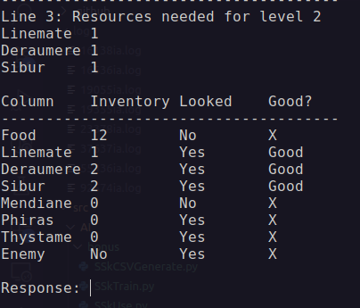

## python script

### Generate CSV file

- Create situation    
```bash
# python3 SSkCSVGenerate.py --help
python3 SSkCSVGenerate.py -l 2 -n 50 -f test.csv
```



#### Column
- Inventory

Simulate the inventory of the AI

- Looked

Simulate if the AI looked resources

- Good?

Check if you have all the resources required for elevation

#### Response
- Basic
    - Find food
    - Take food
    - Take linemate
    - Take deraumere
    - Take sibur
    - Take mendiane
    - Take phiras
    - Take thystame
    - Elevation
- Command
    - q (save and quit)
    - r (remove situation)

- Create test
```bash
# python3 SSkCSVGenerate.py --help
python3 SSkCSVGenerate.py -l 2 -n 50 -f test.csv -t
```
### Create tree
```bash
# python3 SSkTrain.py --help
python3 SSkTrain.py -f test.csv
```
Create .joblib and .png of the tree

### Use for test tree
- Simulate exercise for tree
```bash
# python3 SSkUse.py --help
python3 SSkUse.py -f test_test.csv -t test.joblib
```

- See the benchmark
```bash
# python3 SSkUse.py --help
python3 SSkUse.py -f test_test.csv -t test.joblib -b
```